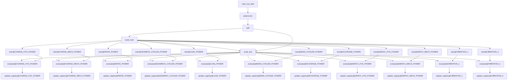

# Training DAG
## Stages

```mermaid
flowchart TD
        node1["evaluate@CHARGE_HYD_POWER"]
        node2["evaluate@CHARGE_MECH_POWER"]
        node3["evaluate@DRIVE_POWER"]
        node4["evaluate@GEARBOX_COOLER_POWER"]
        node5["evaluate@LOAD_POWER"]
        node6["evaluate@MAIN_COOLER_POWER"]
        node7["evaluate@SCAVENGE_POWER"]
        node8["evaluate@SERVO_HYD_POWER"]
        node9["evaluate@SERVO_MECH_POWER"]
        node10["evaluate@VIBRATION_1"]
        node11["evaluate@VIBRATION_2"]
        node12["preprocess"]
        node13["read_raw_data"]
        node14["scale_test"]
        node15["scale_train"]
        node16["split"]
        node17["train@CHARGE_HYD_POWER"]
        node18["train@CHARGE_MECH_POWER"]
        node19["train@DRIVE_POWER"]
        node20["train@GEARBOX_COOLER_POWER"]
        node21["train@LOAD_POWER"]
        node22["train@MAIN_COOLER_POWER"]
        node23["train@SCAVENGE_POWER"]
        node24["train@SERVO_HYD_POWER"]
        node25["train@SERVO_MECH_POWER"]
        node26["train@VIBRATION_1"]
        node27["train@VIBRATION_2"]
        node28["update_registry@CHARGE_HYD_POWER"]
        node29["update_registry@CHARGE_MECH_POWER"]
        node30["update_registry@DRIVE_POWER"]
        node31["update_registry@GEARBOX_COOLER_POWER"]
        node32["update_registry@LOAD_POWER"]
        node33["update_registry@MAIN_COOLER_POWER"]
        node34["update_registry@SCAVENGE_POWER"]
        node35["update_registry@SERVO_HYD_POWER"]
        node36["update_registry@SERVO_MECH_POWER"]
        node37["update_registry@VIBRATION_1"]
        node38["update_registry@VIBRATION_2"]
        node1-->node28
        node2-->node29
        node3-->node30
        node4-->node31
        node5-->node32
        node6-->node33
        node7-->node34
        node8-->node35
        node9-->node36
        node10-->node37
        node11-->node38
        node12-->node16
        node13-->node12
        node14-->node1
        node14-->node2
        node14-->node3
        node14-->node4
        node14-->node5
        node14-->node6
        node14-->node7
        node14-->node8
        node14-->node9
        node14-->node10
        node14-->node11
        node15-->node14
        node15-->node17
        node15-->node18
        node15-->node19
        node15-->node20
        node15-->node21
        node15-->node22
        node15-->node23
        node15-->node24
        node15-->node25
        node15-->node26
        node15-->node27
        node16-->node14
        node16-->node15
        node17-->node1
        node18-->node2
        node19-->node3
        node20-->node4
        node21-->node5
        node22-->node6
        node23-->node7
        node24-->node8
        node25-->node9
        node26-->node10
        node27-->node11
```
